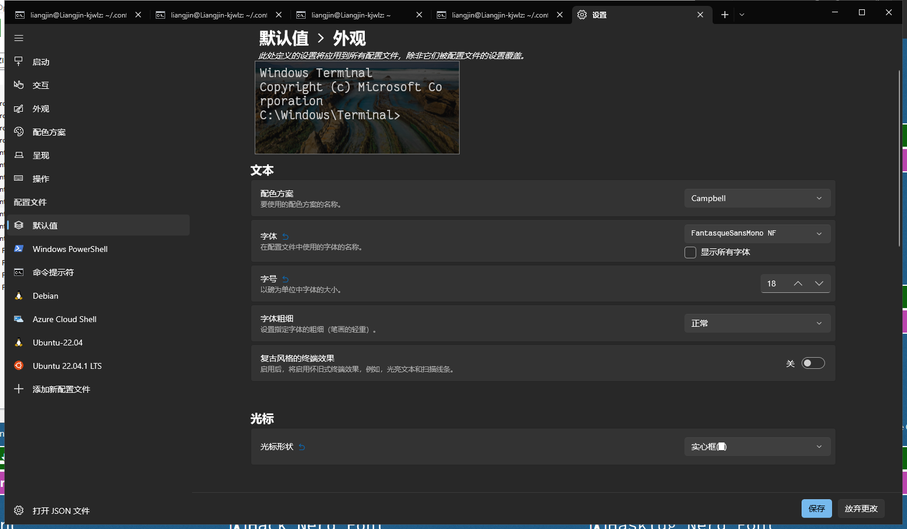

# 插件概述

接下来简要叙述每个插件的功能。

## 1、主题

目前这个配置使用的是[`One dark`](https://github.com/navarasu/onedark.nvim)。

## 2、底部状态栏

底部状态栏使用的是[`lualine.nvim`](https://github.com/nvim-lualine/lualine.nvim)，使用`onedark`主题。
使用该状态栏需要安装[`nvim-web-devicons`](https://github.com/kyazdani42/nvim-web-devicons)插件，以显示特殊图标。
这需要[nerd字体](https://www.nerdfonts.com/font-downloads)的支持。`Windows Terminal`终端安装nerd字体的方法如下：

1.先在`https://www.nerdfonts.com/font-downloads`下载喜欢的字体。

2.下载完成后，解压，安装兼容Windows版本的`......Windows Compatible.ttf`的字体，直接双击安装。

3.打开`Windows Terminal`设置，在配置文件->默认值->外观选择刚刚安装的字体保存即可。如安装`FantasqueSansMono`字体：



## 3、顶部table列表

table列表使用的是[`bufferline.nvim`](https://github.com/akinsho/bufferline.nvim)，使用该插件同样需要安装nerd字体。

## 4、浮动终端

在`neovim`中唤出终端，可以直接在`neovim`中执行命令，不需要离开`neovim`，项目地址为[vim-floaterm](https://github.com/voldikss/vim-floaterm)。

## 5、文件搜索

使用[`vim-floaterm`](https://github.com/voldikss/vim-floaterm)插件，该插件可以显示悬浮搜索窗。使用这个插件需要安装[`plenary.nvim`](https://github.com/nvim-lua/plenary.nvim)。

## 6、多光标

在`neovim`中使用多个光标，同时编辑多处文本，项目地址[`vim-visual-multi`](https://github.com/mg979/vim-visual-multi)。

## 7、代码格式化

编辑代码时，自动格式化代码，该插件依赖于[`astyle`](https://astyle.sourceforge.net/)。在`debian`系的`linux`系统下，可以直接使用以下命令安装：

```bash
sudo apt install astyle
```

`astyle`的参数文件位于`config/astylerc`中。

## 8、代码检查

编写C/C++代码时，静态检查代码，提前发现错误，项目地址为[ale](https://github.com/dense-analysis/ale)。该插件依赖于[clangd](https://clangd.llvm.org/)，在`debian`系的`linux`系统下，可以直接使用以下命令安装：

```bash
sudo apt install clangd
```

## 9、自动补全

使用[`coc.nvim`](https://github.com/neoclide/coc.nvim)的`lsp`自动补全，该插件依赖于[node.js](https://nodejs.org/en/)。注意，该插件还要求`node.js`的版本高于14.14，而`ubuntu`中直接通过`apt install nodejs`安装的版本小于14.14，`linux`下可以通过以下命令进行安装：

```bash
curl -sL install-node.vercel.app/lts | bash
```

## 10、函数跳转

在编辑代码过程中，自动跳转到对应函数，项目地址为[`vim-gutentags`](https://github.com/ludovicchabant/vim-gutentags)。该插件依赖于`ctags`，在`debian`系的`linux`系统下使用以下命令安装：

```bash
sudo apt install universal-ctags
```

## 11、代码注释

快速注释C/C++代码，项目地址为[nerdcommenter](https://github.com/preservim/nerdcommenter)。

## 12、彩虹括号

配对的括号使用相同颜色高亮，不配对括号使用不同颜色高亮，项目地址[rainbow](https://github.com/luochen1990/rainbow)。

## 13、文件树

在`neovim`中浏览文件，项目地址[nvim-tree.lua](https://github.com/kyazdani42/nvim-tree.lua)。使用该插件需要安装nerd字体，显示各种图标。